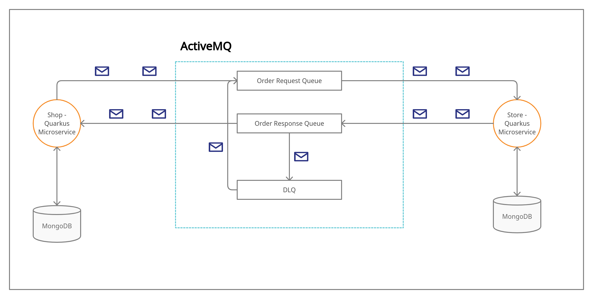

# Falcon producer-consumer project

This project contains 'Store' and 'Shop' sub-projects as java microservices.
They are communicating via AMQP 1.0 broker (ActiveMQ). Both of them are implemented using Java and Quarkus
and are exposing REST APIs.

## Prerequisites

- Java 11 - [Installation](https://adoptopenjdk.net/)
- Maven - [Installation](https://maven.apache.org/install.html)
- Docker - [Installation](https://www.docker.com/get-started)
- Docker Compose - [Installation](https://docs.docker.com/compose/install/)

## Development setup

### Start MongoDB and ActiveMQ
You can start them by going to the root directory of the project and executing:
```bash
docker-compose -f docker-compose-infrastructure up -d
```
This command will start both of the services on a separate container.

### Start Store and Shop in dev mode
Go to the `/shop` folder and execute:
 ```
./mvnw compile quarkus:dev -Ddebug=5006
```
Then go to the `/store` folder and execute:
 ```
./mvnw compile quarkus:dev
```
Shop is exposing port `5006` for remote debugging and the store is using the default one: `5005`.

## Docker setup
In order to run everything on separate docker containers we need to package the microservices first.
For both projects go to their directore and execute:
```
./mvnw clean package
```
Now got back to the root folder and execute:
```
docker-compose up -d
```
## UI page
### Shop - `http://{host}:8080/` 
The page is displaying all orders with their statuses. The data is updated live.
## REST APIs
### Shop
- `POST` `http://{host}:8080/api/orders` - creates new order request

    ```
    {
        "productRequests": [
            {
                "name": "melon",
                "quantity": 5
            }, ...
        ]
    }
    ```
### Store
- `GET` `http://{host}:8081/api/products` - checks and returns for each product the number that is
                                        requested but not in stock
- `POST` `http://{host}:8081/api/products` - loads more products into the Store - (productId,
                                             quantity)
    ```
    [
        {
            "name": "melon",
            "quantity": 5
        }, ...
    ]
    ```
## Architecture



## Possible future improvements
- Environment variables or configuration server for all sensitive data
- Lombok integration
- Message Redelivery and DLQ Handling for ActiveMQ configuration
- ...
